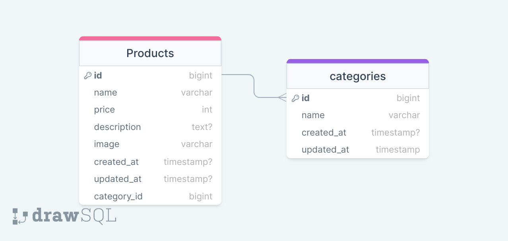

# Mahez Pradana-Universitas Lampung

## Desain Database
- Cart tidak menggunakan database, hanya menggunakan session dan variable php



## Installation

1. Clone the project

```sh
    git clone
```
2. Move to project folder
3. Install composer dependencies
```sh
    composer install
```
4. Install NPM dependencies
```sh
    npm install
```
5. Copy .env
```sh
    cp .env.example .env
```
6. Generate laravel key
```sh
    php artisan key:generate
```
7. Create an empty database and change DB_DATABASE on .env
8. Migrate database
```sh
    php artisan migrate
```
9. Run seeder for example database
```sh
    php artisan db:seed
```
10. Run project
```sh
    php artisan serve
```
